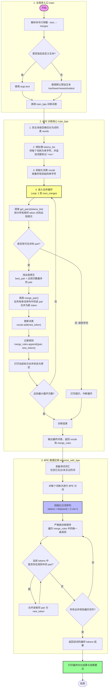

```mermaid
graph TD
    %% 样式定义
    style A fill:#f9f,stroke:#333,stroke-width:2px
    style AD fill:#9f9,stroke:#333,stroke-width:2px
    style J fill:#ff9,stroke:#333,stroke-width:2px
    style X fill:#bbf,stroke:#333,stroke-width:2px

    %% 1. 主程序入口
    subgraph Main [1. 主程序入口 main]
        A([开始]) --> B[解析命令行参数 --text, --merges]
        B --> C{是否指定自定义文本?}
        C -- 是 --> D[使用 args.text]
        C -- 否 --> E[使用默认预设文本 low/lower/newest/widest]
        D --> F[调用 train_bpe 训练词表]
        E --> F
    end

    %% 2. BPE 训练阶段
    subgraph BPE_Train [2. BPE 训练核心 train_bpe]
        F --> G[1. 将文本按空格切分为词列表 words]
        G --> H["2. 预处理 tokens_list<br>将每个词拆为单字符，并追加词尾标记 '&lt;/w&gt;'"]
        H --> I["3. 初始化词表 vocab<br>收集所有初始的单字符"]
        
        I --> J[4. 进入合并循环<br>Loop: 1 到 num_merges]
        
        %% 循环内部
        J --> K["调用 get_pairs(tokens_list)<br>统计所有相邻 token 对的出现频次"]
        K --> L{是否有可合并的 pair?}
        L -- 否: 提前学完 --> M[打印提示，中断循环]
        L -- 是 --> N["找出高频王<br>best_pair = 出现次数最多的 pair"]
        
        N --> O["调用 merge_pair()<br>在所有单词序列中将该 pair 合并为新 token"]
        O --> P["更新词表<br>vocab.add(new_token)"]
        P --> Q["记录规则<br>merge_rules.append((pair, new_token))"]
        Q --> R[打印当前轮次合并状态与预览]
        
        R --> S{达到最大循环次数?}
        S -- 否 --> J
        S -- 是 --> T[训练结束]
        M --> T
        
        T --> U[输出最终词表，返回 vocab 和 merge_rules]
    end

    %% 3. 分词推理阶段
    subgraph BPE_Inference [3. BPE 推理应用 tokenize_with_bpe]
        U --> V[准备测试词汇<br>包含已见过/未见过的词]
        V --> W[对每个词依次进行 BPE 分词]
        W --> X["初始化分词序列<br>tokens = list(word) + ['&lt;/w&gt;']"]
        
        X --> Y["严格按训练顺序<br>遍历 merge_rules 中的每一条规则"]
        Y --> Z{当前 tokens 中<br>是否存在规则中的 pair?}
        Z -- 是 --> AA[合并该相邻 pair 为 new_token]
        AA --> Z
        Z -- 否 --> AB{所有合并规则遍历完毕?}
        AB -- 否 --> Y
        AB -- 是 --> AC[返回该词的最终 tokens 结果]
    end

    AC --> AD[打印最终对比结果与观察要点]
    AD --> AE([结束])
```